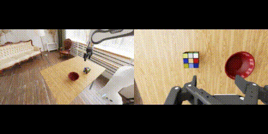
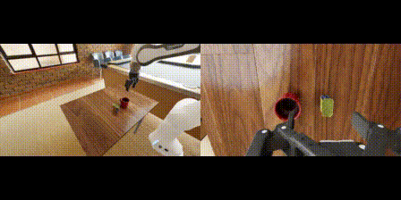
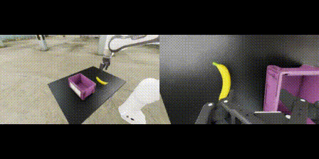

# DROID Sim Evaluation

This repository contains scripts for evaluating DROID policies in a simple ISAAC Sim environment.

Here is an example rollout of a pi0-FAST-DROID policy:

Scene 1



Scene 2



Scene 3



The simulation is tuned to work *zero-shot* with DROID policies trained on the real-world DROID dataset, so no separate simulation data is required.

**Note:** The current simulator works best for policies trained with *joint position* action space (and *not* joint velocity control). We provide examples for evaluating pi0-FAST-DROID policies trained with joint position control below.


## Installation

Clone the repo
```bash
git clone --recurse-submodules git@github.com:arhanjain/sim-evals.git
cd sim-evals
```

Install uv (see: https://github.com/astral-sh/uv#installation)

For example (Linux/macOS):
```bash
curl -LsSf https://astral.sh/uv/install.sh | sh
```

Create and activate virtual environment
```bash
uv sync
source .venv/bin/activate
```

## Quick Start

First, make sure you download the simulation assets into the root of this directory
```bash
uvx hf download owhan/DROID-sim-environments --repo-type dataset --local-dir assets
```

If the assets live somewhere else, point the evaluator at that directory:
```bash
export SIM_EVALS_ASSET_ROOT=/path/to/assets
```

Then, in a separate terminal, launch the policy server on `localhost:8000`. 
For example, to launch a pi0-FAST-DROID policy (with joint position control),
checkout [openpi](https://github.com/Physical-Intelligence/openpi) and use the `polaris` configs 
```bash
XLA_PYTHON_CLIENT_MEM_FRACTION=0.5 uv run scripts/serve_policy.py policy:checkpoint --policy.config=pi05_droid_jointpos_polaris --policy.dir=gs://openpi-assets/checkpoints/pi05_droid_jointpos
```

**Note**: We set `XLA_PYTHON_CLIENT_MEM_FRACTION=0.5` to avoid JAX hogging all the GPU memory (incase Isaac Sim is using the same GPU).

Finally, run the evaluation script:
```bash
python run_eval.py --episodes [INT] --environment DROID-CubeInBowl --headless
```

The current scenes are also registered as individual Gym environments:

All `Scene.usd` paths below are relative to `assets/` or `SIM_EVALS_ASSET_ROOT`.

| Environment ID | Expected `Scene.usd` |
| --- | --- |
| `DROID-CubeInBowl` | `scene1.usd` |
| `DROID-CanInMug` | `scene2.usd` |
| `DROID-BananaInBin` | `scene3.usd` |
| `DROID-Berkeley-Task1` | `Berkeley/Berkeley_Task1/Scene.usd` |
| `DROID-UPenn-FrankaKitchen` | `UPenn/TASK-1-Levine457-FrankaKitchen/Scene.usd` |
| `DROID-UPenn-TeaRoom` | `UPenn/TASK-2-Levine459-TeaRoom/Scene.usd` |
| `DROID-UPenn-LivingRoom` | `UPenn/TASK-3-AGH-LivingRoom/Scene.usd` |
| `DROID-UTAustin-Task1` | `UT-Austin/UT-Austin-Task1/Scene.usd` |
| `DROID-UTAustin-Task2` | `UT-Austin/UT-Austin-Task2/Scene.usd` |
| `DROID-UTAustin-Task3` | `UT-Austin/UT-Austin-Task3/Scene.usd` |
| `DROID-Yonsei-Task1` | `Yonsei/Task1_20260424/Scene.usd` |
| `DROID-Yonsei-Task2` | `Yonsei/Task2/Scene.usd` |
| `DROID-MILA-Task1` | `MILA/Task1/Scene.usd` |
| `DROID-MILA-Task2` | `MILA/Task2/Scene.usd` |
| `DROID-FrodoBots-Task1` | `FrodoBots/Task1/Scene.usd` |
| `DROID-FrodoBots-Task2` | `FrodoBots/Task2/Scene.usd` |

You can run a named environment directly:
```bash
python run_eval.py --episodes [INT] --environment DROID-CanInMug --headless
```

For LW environments, pass the task prompt explicitly when needed:
```bash
python run_eval.py --episodes [INT] --environment DROID-MILA-Task1 --instruction "Pick up the spoon and place it in the sink." --headless
```

## Minimal Example

```python
env = gym.make("DROID-CubeInBowl", cfg=env_cfg)

obs, _ = env.reset()
obs, _ = env.reset() # need second render cycle to get correctly loaded materials
client = # Your policy of choice

max_steps = env.env.max_episode_length
for _ in tqdm(range(max_steps), desc=f"Episode"):
    action = client.infer(obs, INSTRUCTION) # calling inference on your policy
    action = torch.tensor(ret["action"])[None]
    obs, _, term, trunc, _ = env.step(action)
    if term or trunc:
        break
env.close()
```
